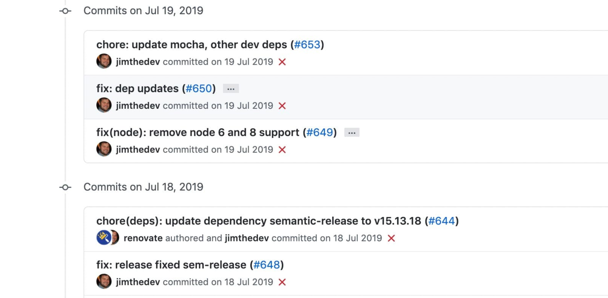

# Git Commit 规范



## 1. Commit 格式

每个 commit 消息必须包含以下部分：

```
<type>(<scope>): <subject>
<BLANK LINE>
<body>
<BLANK LINE>
<footer>
```

## 2. 类型说明 (type)

- `feat`：新增功能
- `fix`：修复 bug
- `docs`：文档更新
- `style`：代码格式调整（不影响代码逻辑）
- `refactor`：代码重构（既不是修复 bug 也不是新增功能）
- `perf`：性能优化
- `test`：测试相关
- `chore`：构建过程或辅助工具的变动
- `revert`：回滚 commit

## 3. 范围说明 (scope)

- 可选字段，表示影响范围
- 示例：`(user)`、`(auth)`、`(api)`

## 4. 提交示例

**简单提交：**

```bash
git commit -m "feat(user): add login functionality"
```

**详细提交：**

```bash
git commit -m "fix(auth): handle null pointer in login API

- Add null check for user object
- Update error handling logic

Closes #123"
```

## 5. 提交规范细则

- **标题行**：
  - 不超过 50 个字符
  - 使用现在时（"add" 而不是 "added"）
  - 首字母小写
  - 不加句号
- **正文**：
  - 使用现在时
  - 说明修改动机和与之前行为的对比
  - 每行不超过 72 个字符
- **页脚**：
  - 关联 issue 使用 `Closes #123` 或 `Fixes #123`
  - 重大变更需要添加 `BREAKING CHANGE: ` 说明

## 6. 示例集合

```bash
# 功能新增
feat(user): add profile edit page

# Bug 修复
fix(login): handle session timeout

# 文档更新
docs(readme): update installation guide

# 代码重构
refactor(auth): extract token validation logic

# 性能优化
perf(api): optimize database queries

# 测试相关
test(user): add login failure cases

# 样式调整
style: format code with prettier

# 构建工具
chore: update webpack config

# 回滚提交
revert: revert "feat(user): add profile page"
```

## 7. 工具支持

- 使用 [commitizen](https://commitizen.github.io/cz-cli/) 工具辅助规范提交：
  ```bash
  npm install -g commitizen
  cz-conventional-changelog
  ```
- 使用 husky 添加 commit 钩子检查
- 使用 commitlint 进行格式验证
