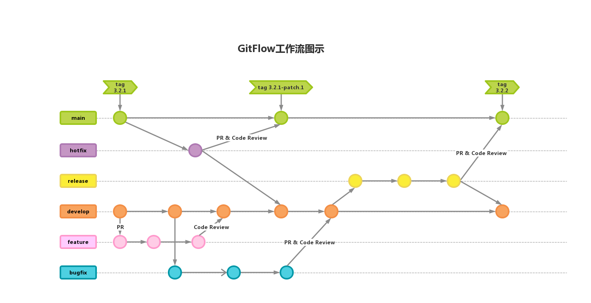

# Git Flow Guidelines



[Git Tutorial](https://www.atlassian.com/git/tutorials/what-is-version-control)

## 1. Branch Management

- **Main Branches**
  - `main`: Stable version for production use
  - `develop`: Main branch for daily development
- **Supporting Branches**
  - `feature/*`: Feature development branches
    - Example: `feature/user-auth` for user authentication feature development
    - Example: `feature/payment-integration` for payment integration feature development
  - `bugfix/*`: Bug fix branches
    - Example: `bugfix/login-error` for fixing login errors
    - Example: `bugfix/404-page` for fixing 404 page display issues
  - `release/*`: Release branches
    - Example: `release/v1.2.0` for version 1.2.0 release
  - `hotfix/*`: Hotfix branches
    - Example: `hotfix/critical-security` for urgent security vulnerability fixes

## 2. Workflow Examples

**Feature Development Workflow:**

1. Create a feature branch from `develop`
   ```bash
   git checkout -b feature/user-profile develop
   ```
2. Commit changes after development
   ```bash
   git commit -m "feat(user): add profile page"
   ```
3. Push to the remote repository
   ```bash
   git push origin feature/user-profile
   ```
4. Create a Pull Request to the `develop` branch
5. Merge after code review approval

**Release Workflow:**

1. Create a release branch from `develop`
   ```bash
   git checkout -b release/v1.2.0 develop
   ```
2. Perform final testing and fixes
3. Merge into `main` and tag the release
   ```bash
   git checkout main
   git merge --no-ff release/v1.2.0
   git tag -a v1.2.0 -m "Release version 1.2.0"
   ```
4. Sync with `develop`
   ```bash
   git checkout develop
   git merge --no-ff release/v1.2.0
   ```
5. Delete the release branch
   ```bash
   git branch -d release/v1.2.0
   ```

**Hotfix Workflow:**

1. Create a hotfix branch from `main`
   ```bash
   git checkout -b hotfix/login-error main
   ```
2. Fix the issue and commit
   ```bash
   git commit -m "fix(login): handle null pointer exception"
   ```
3. Merge into `main` and tag the hotfix
   ```bash
   git checkout main
   git merge --no-ff hotfix/login-error
   git tag -a v1.2.1 -m "Hotfix for login error"
   ```
4. Sync with `develop`
   ```bash
   git checkout develop
   git merge --no-ff hotfix/login-error
   ```
5. Delete the hotfix branch
   ```bash
   git branch -d hotfix/login-error
   ```

## 3. Version Management Examples

- **Major Update**: `v2.0.0` (Significant architecture changes, not backward compatible)
- **Feature Update**: `v1.3.0` (New user permission management feature)
- **Bug Fix**: `v1.2.1` (Fix login page style issue)
- **Pre-release Version**: `v1.3.0-rc.1` (First release candidate for version 1.3.0)
- **Beta Version**: `v1.3.0-beta.2` (Second beta version for 1.3.0)

## 4. Best Practices

- Keep commit history clean
  - Use `git rebase` to organize commit records
  - Avoid direct commits to `main` and `develop` branches
- Clean up merged branches promptly
- Use `--no-ff` option for merges to preserve branch history
- Tag each release for easy rollback

## References

- [A successful Git branching model](https://nvie.com/posts/a-successful-git-branching-model/)
- [Understanding GitHub Flow and Git Flow](https://medium.com/@yanminthwin/understanding-github-flow-and-git-flow-957bc6e12220)
