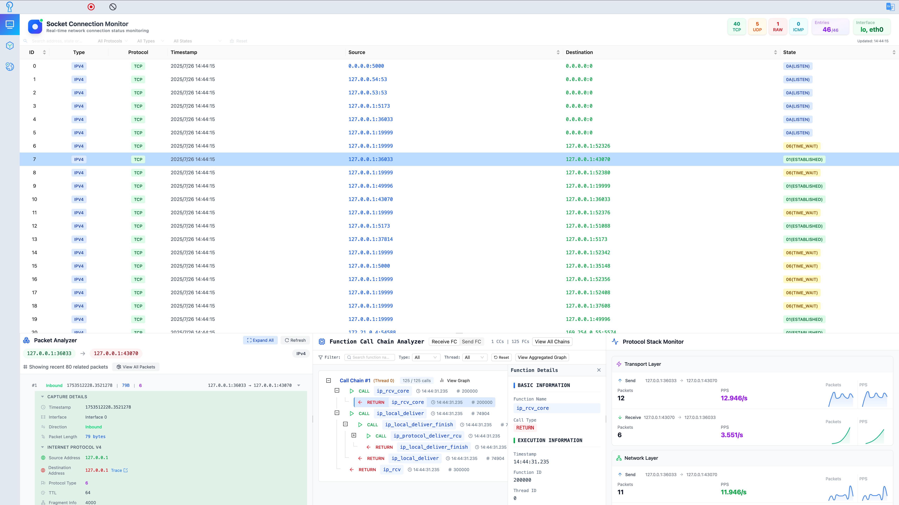

<div align="center">
  

</div>
<p align="center"><a href="./README.md">English</a> · 中文</p>

<div align="center">
  
  
</div>

# PacketScope：服务器端侧防御的“智能铠甲”

**PacketScope** 是一款基于 eBPF 的协议栈通用分析调试工具，集性能优化、异常诊断与安全防御于一体。它致力于在服务器端实现对网络分组（Packet）在协议栈中的细粒度追踪与智能分析，解决开放服务器面临的性能瓶颈难诊断、传输路径不明晰、底层攻击难防御等三大痛点，提供可视化、智能化的端侧安全分析与防护能力。



## 背景

随着社交平台、网银服务、大模型应用、物流出行等互联网服务日益普及，开放服务器作为关键的资源执行环境，必须在可被任何人访问的前提下，兼顾性能和安全。传统 WAF、IDS 等手段在协议栈层面的防护存在盲区，PacketScope 正是为此而生：

> **🚨 三大核心痛点**：
>
> 1. 分组穿越协议栈路径不透明，瓶颈及故障点难定位
> 2. 分组跨域传输路径缺乏细粒度数据，路由风险不可见
> 3. 协议栈底层攻击隐蔽难测，传统防御工具能力有限

通过协议追踪、路径可视化、智能分析，PacketScope 为服务器构建“智能铠甲”。

## 🚀 核心能力

- 🧠 **智能驱动**：结合 eBPF 与大语言模型，提供底层网络行为观测与智能化安全防护
- 📊 **多维度分析**：实时追踪网络路径，统计延迟、丢包率、交互频率等指标
- 🌐 **全球网络可视化**：测绘全球路径及延迟，并可视化展示在拓扑图中
- 🔐 **协议栈级防护**：识别并拦截协议栈层的异常流量，弥补传统 WAF/IDS 空白
- 🖥️ **图形化界面**：用户友好的操作界面，便于安全工程师和运维人员快速上手

## ⚡ 快速开始

### 启动服务器

本项目包含多个服务端模块，分别采用不同的编程语言实现。请根据各模块目录下的 `README.md` 文件说明，依次完成依赖安装与服务启动操作。

模块结构如下：

```bash
modules
├── Analyzer  # Python 实现的协议栈分析模块
├── Guarder   # Go 实现的安全策略模块
├── Locator   # Python 实现的网络定位模块
└── Tracer    # Python 实现的流量监测和细粒度追踪模块
```

### 启动前端服务

本项目前端基于 [Node.js](https://nodejs.org/en) 环境构建，请确保已正确安装 Node.js（推荐版本 ≥ 16）。

#### 一、安装依赖

在项目根目录下执行以下命令安装所需依赖包：

```bash
npm install
```

> ⚠️ 如果您位于国内，建议配置 [npm 镜像源](http://registry.npmmirror.com) 以提高安装速度：

```bash
npm config set registry http://registry.npmmirror.com
```

#### 二、启动服务

使用以下命令启动前端服务（以预览模式运行构建后的应用）：

```bash
npm run preview
```

该命令会在本地启动一个静态服务，默认监听端口为 `4173`。

#### 三、访问应用

在浏览器中打开以下地址访问应用界面：

```
http://localhost:4173/
```

> 💡 如需以开发模式运行（启用热更新），可使用以下命令：

```bash
npm run dev
```

> 💡 如需打包生成生产环境代码，可使用以下命令：

```
npm run build
```

## ✨ 功能模块

- **Tracer（追踪器）**

  Tracer 模块用于追踪连接/分组在协议栈中的交互，生成详细的可视化路径图。用户可以通过点击路径图查看不同层级的调用细节，帮助理解协议栈中数据流的详细路径和交互过程。

- **Analyzer（分析器）**

  Analyzer 模块提供协议栈中分组数据流动的多维度信息统计。它可以统计数据流量、延迟、跨层交互频率、丢包率等关键指标，帮助用户全面了解网络性能和瓶颈。

- **Locator（定位器）**

  Locator 模块用于测绘从主机到全球任一 IP 地址的路径及延迟，并在全球拓扑上展示这些信息。用户可以实时查看不同地理位置间的网络延迟及路由路径，为网络优化提供数据支持。

- **Guarder（防护器）**

  Guarder 模块负责异常分组的过滤与管控。用户可以自定义规则以检测和控制异常流量，并且该模块还结合大语言模型（LLM）提供上下文信息，帮助用户更好地理解和应对潜在的网络安全威胁。

## 🧰 使用场景

- **网络协议栈性能优化**：帮助网络管理员和开发者分析网络协议栈中的流量瓶颈，优化性能。
- **网络安全威胁检测**：监控并过滤异常流量，检测潜在的攻击模式（如 DDoS、ARP 欺骗等），增强网络安全性。
- **网络故障诊断**：诊断因网络延迟、丢包或跨层交互异常引起的问题，快速定位故障源。
- **网络拓扑分析**：在跨地域或跨国网络环境中，分析网络拓扑结构、路径延迟和路由性能，为全球部署提供支持。
- **工业互联网安全**：在工业互联网环境中，对工业控制系统的协议栈进行实时监控和安全审计，保障设备和数据的安全性。

## ❤️ 贡献

欢迎提交问题和合并请求！如果你发现任何问题或有改进建议，请在 issues 中提出，或直接提交 pull request。具体贡献指南请参考[CONTRIBUTING](./CONTRIBUTING.md)

## 许可

该项目遵循 MIT 许可证，详情请见 [LICENSE](./LICENSE)。
